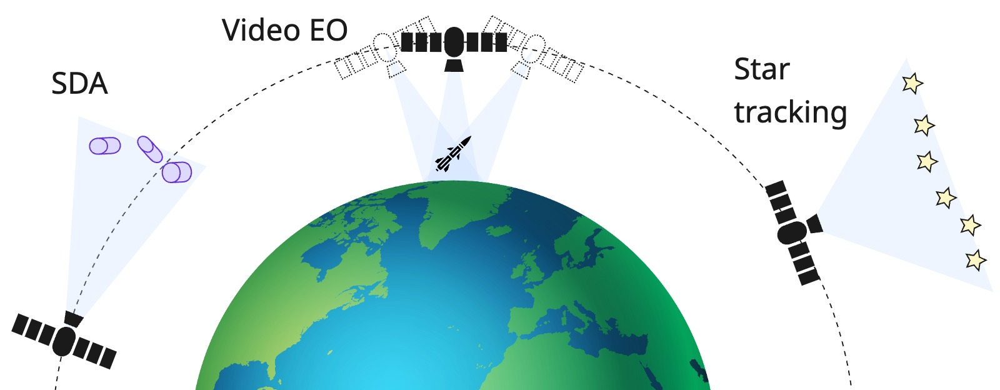
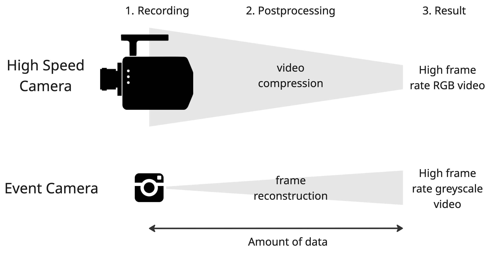
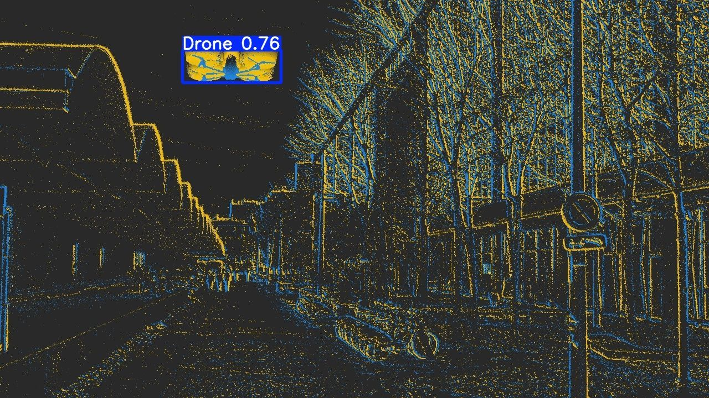
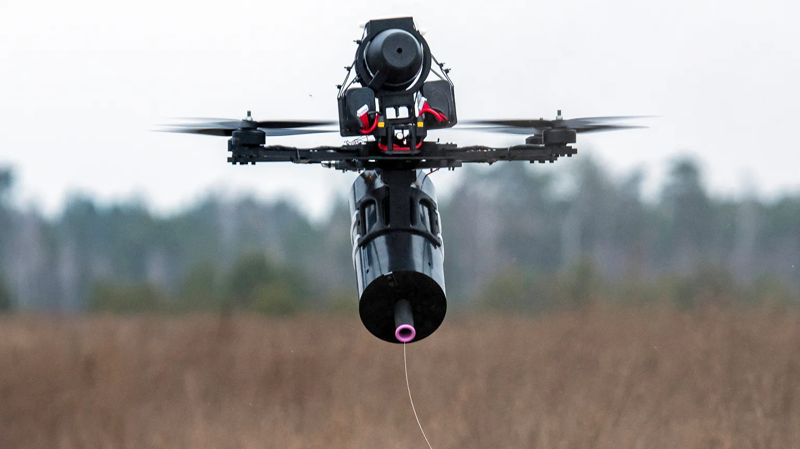
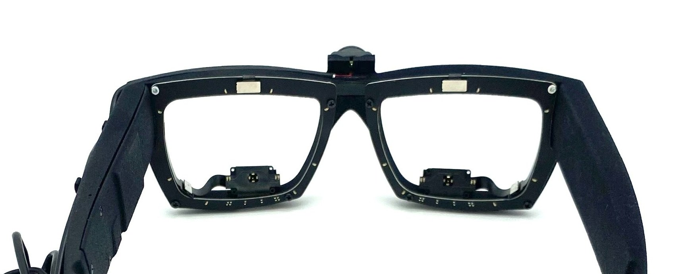

Earlier this year, I stepped down as CTO of [Neurobus](https://neurobus.ai) and transitioned to a role in the field of robotics in London. Despite that shift, I still believe in the potential of event cameras, especially for edge computing. Their asynchronous data capture model is promising, but the technology isn’t quite there yet. In two parts, I want to outline the main markets that I think could drive the adoption of event cameras and also talk about what’s currently holding the technology back.

## Industry landscape
Fifteen years ago, the market for event cameras barely existed. Today, it’s worth around 220 million dollars. That rate of growth is actually in line with how most sensor technologies develop. LiDAR, for example, was originally created in the 1970s for military and aerospace applications. It took decades before it found its way into mainstream products, with broader adoption only starting in the 2010s when autonomous vehicles began to emerge. Time-of-flight sensors were originally explored in the 1980s, but only became widespread after Apple introduced Face ID in 2015.

Event cameras appear to be following the same trajectory. They’ve been tested across various industries, but none have yet revealed a compelling, large-scale use case that pushes them into the mainstream. When we started Neurobus in 2023, there were already several companies building neuromorphic hardware such as event-based sensors and processors. What was missing was a focus on the software and real-world applications. Camera makers were happy to ship dev kits, but few people were actually close to end users. Understanding when and why an event camera outperforms a traditional RGB sensor requires deep domain knowledge. That’s the gap I tried to bridge.

It quickly became clear that finding the right applications is incredibly difficult. Adoption doesn’t just depend on technical merit. It needs mature software, supporting hardware, and a well-defined use case. In that sense, event cameras are still early in their journey. Over the past year, I’ve explored several sectors to understand where they might gain a foothold. 

## Space
The private space sector has grown quickly in the last two decades, largely thanks to SpaceX. By driving down launch costs to a fraction of what they used to be, the company has made it far easier to get satellites into orbit. Here is a lovely graph showing launch costs over the past decades. Notice the logarithmic y axis! Those launch costs are going to continue to drop as rockets with bigger payloads, such as Starship, are developed. 

<iframe src="https://ourworldindata.org/grapher/cost-space-launches-low-earth-orbit?tab=chart" loading="lazy" style="width: 100%; height: 600px; border: 0px none;" allow="web-share; clipboard-write"></iframe>

### Space Situational Awareness (SSA) from the ground
With more satellites in orbit, the risk of collisions increases, and that’s where space situational awareness, or SSA, comes into play. At the moment, the US maintains a catalogue of orbital objects and shares it freely with the world, but it’s unlikely that this will remain free forever. Other countries are starting to build their own tracking capabilities, particularly for objects in Low Earth Orbit (LEO), which spans altitudes up to 2,000 kilometers. SSA is mostly handled from the ground, using powerful RADAR systems. These systems act like virtual fences that detect any object passing through, even those as small as eight centimeters at an altitude of 1,500 kilometers. RADARs are expensive to build and operate, but their range and reliability are unmatched. For SSA solutions on the ground, optical systems play a smaller role of real-time tracking of specific objects. People built ground-based [event camera SSA systems](https://www.westernsydney.edu.au/icns/research_projects/current_projects/astrosite), but it is not clear what advantages they bring over conventional, high resolution, integrating sensors. There’s nothing that I know of up there that is spinning so fast that you need microsecond resolution to capture it. 

### Space Domain Awareness (SDA) in orbit
As orbit becomes more crowded and militarized, the need to monitor areas in real time is growing, especially regions not visible from existing ground stations (as in, anywhere other than your country and allies). Doing this from space itself offers a significant advantage, but using RADAR in orbit isn’t practical due to the power constraints of small satellites. Instead, optical sensors that can quickly pivot to observe specific areas are a better fit. To achieve good coverage, you’d need a large number of these satellites, which means that payloads must be compact and low-cost. This is where event cameras could come in. Their power efficiency makes them ideal for persistent monitoring, especially in a sparse visual environment like space. Since they only capture changes in brightness, pointing them into mostly dark space allows them to exploit sparsity very well. The data they generate is already compressed, reducing the bandwidth needed to transmit observations back to Earth. For low-power surveillance satellites in LEO, that’s a significant advantage.

### Earth Observation (EO)
In Earth observation, optical sensors sit on satellites that need to orbit as low as possible in order to increase angular resolution / swath. They revolve around the Earth roughly every 90 minutes, capturing the texture-rich surface. Using an event camera for that would just generate enormous amounts of data that is of the wrong kind anyway because in EO you are interested in multispectral bands and high spatial resolution. However there is a case that might make it worthwhile: when you compensate for the lateral motion of the satellite and fixate the event camera on a specific spot for continuous monitoring. Such systems exist today already (check out [this dataset](https://github.com/QingyongHu/VISO))  to monitor airports, city traffic and probably some missile launch sites. Using an event camera for that would reduce processing to a bare minimum, and provide high temporal resolution objects that move. The low data rate would also allow for super low bandwidth live video streaming! Unless we’re talking constellations of 10k+ satellites however, it remains a niche use case for the military to monitor enemy terrain.

*Potential applications of event cameras in orbit. 1. Space Domain Awareness (SDA) is about receiving requests from the ground to monitor an object in LEO in real time. 2. Video live streaming Earth observation (EO). Compensating for the satellite's lateral motion, event cameras could monitor sites for ~10 minutes per orbit, depending on the altitude. 3. Star tracking. Lots of redundant background means that we can focus on the signal of interest using little processing.*

### In-orbit servicing
In-orbit servicing includes approaching and grabbing debris to de-orbit it or docking with another satellite or spacecraft for refueling or repair. These operations are delicate and often span several hours, typically controlled from the ground. With the number of satellites in orbit continuously increasing and [as many as 10 space stations planned](https://en.wikipedia.org/wiki/List_of_space_stations#Planned_and_proposed) to be built within the next decade, reliable and autonomous docking solutions will become essential. Current state-of-the-art systems already use stereo RGB and LiDAR, but event cameras might offer benefits in challenging lighting conditions or when very fast, reactive maneuvers are needed in emergency situations. I think that in-orbit servicing has many other challenges before event cameras fix the most pressing problem in that area. 

### Star tracking
Star trackers are a standard subsystem on most satellites. Companies like [Sodern](https://sodern.com/en/star-trackers/) sell compact, relatively low-cost units that point upward into the sky to determine a satellite’s orientation relative to known star constellations. Today’s trackers typically deliver attitude estimates at around 10–30 Hz, consuming 3–7 W depending on the model. For most missions, that’s good enough, but there’s room for improvement.
Since stars appear as sparse, bright points against an almost entirely dark background, they align perfectly with the event camera’s strengths. Instead of continuously integrating the whole scene, an event-based tracker could focus only on the few pixels where stars actually appear, cutting down on unnecessary processing. In principle, this allows attitude updates at kilohertz rates while using less compute and bandwidth. Faster updates could improve control loops during high-dynamic maneuvers or enable more precise pointing for small satellites that lack bulky stabilization hardware.
From a software perspective, the task remains relatively simple: once the events are clustered into star positions, the rest of the pipeline is the conventional map-matching problem of aligning observations to a star catalogue. No complex machine learning is needed. The main challenge, as with any space payload, lies in making the hardware resilient to radiation and thermal extremes.

### Revenue generation
In space applications, cost isn’t the limiting factor, which would make it a great place to start testing equipment that is not mass produced yet. Space-grade systems already command premium prices, so a $1,000+ event camera is not out of place. Compared to SDA and EO video streaming, which can generate recurring revenue as a service by providing recent and real-time data, in-orbit servicing systems or star trackers are more likely to be sold as one-off hardware solutions, which makes the business case less scalable.
In either case, there’s a growing need for advanced vision systems that can operate efficiently on the edge in space. Right now, the space market for event cameras is still at an early stage, but the interest is real. 

## Manufacturing / Science
In industrial vision, specifically in manufacturing and scientific environments, objects move fast and precision matters. These settings are full of high-speed conveyor belts, precise milling machines, and equipment that needs real-time monitoring. On paper, this seems like a great match for event cameras, which excel in capturing rapid motion with minimal latency. But the reality is more complicated.
In most factories, computer vision systems are already deeply integrated into broader automation pipelines. Changing a single sensor, even for one with better temporal precision, often isn’t worth the disruption. If a factory wants slightly better accuracy, they can usually just upgrade to a 100+ Hz version of their existing system. Need to count bottles flying past on a line? A cheap line-scanning camera will do the trick. Want to monitor vibrations on a machine? A one-dollar vibration sensor is simpler and more reliable.

Some also consider battery-powered monitoring devices for warehouses and other low-maintenance settings, where low-power vision sensors could make sense. But even there, the appeal is limited in my experience. Someone still has to replace or recharge the battery eventually, and most computer vision systems already do a good enough job without needing an event-based solution.
That said, there are niche applications where event cameras could shine. High-speed scientific imaging is one example, such as tracking combustion events in engines, analysing lightning, or sorting high-throughput cell flows in cytometry. Today, these tasks often rely on bulky high-speed cameras like a [Phantom](https://www.phantomhighspeed.com/), which require artificial lighting, heavy cooling systems, and massive data pipelines, often just to record a few seconds of footage.

Event cameras could offer a much more compact and energy-efficient alternative. They don’t need high-speed links or huge data buffers, and they can be powered through a USB port and still achieve sub ms latency. I think that event cameras could become a competitor for the use of high speed cameras in scientific settings, with a focus on small form factor and mobile applications. One challenge and active research area here is reconstructing high-quality video frames from events. The good news is that we’re seeing steady progress, and there’s even a public leaderboard tracking the latest benchmarks [here](https://ercanburak.github.io/evreal.html). However, these methods currently consume an entire 100W GPU so they’re done offline. One of the biggest hurdles is collecting good ground truth data for what reconstructed frames should look like, which is why most researchers still rely on simulation. But if such reconstruction models get very good, I could imagine a business model where a user uploads the raw events, chooses the desired fps, and gets back videos with up to 10k fps. Pricing is per frame reconstructed, be it 10 Hz for 2 hours or 1 kHz for 1 second.
  

*A comparison between a high-speed camera and an event camera. The high-speed camera workflow shows three steps: recording, postprocessing with video compression, and the result as high frame rate RGB video. This path requires handling a large amount of data. The event camera workflow shows recording followed by frame reconstruction, leading to high frame rate greyscale video, while generating much less data overall. The diagram highlights how event cameras provide efficient high-speed imaging compared to traditional high-speed cameras.*

## Automotive
Event cameras in cars have had several testers, but none have stuck to it for now. While the technical case is strong, the path to adoption is complex, shaped by legacy systems, cost constraints, and the structure of the automotive supply chain.
Modern cars already rely on a robust stack of sensors. RGB cameras, LiDAR, RADAR, and ultrasonic sensors all work together to enable functions like adaptive cruise control, lane keeping, emergency braking, and parking assistance. These systems are designed to be redundant and resilient across various weather and lighting conditions. For a new sensor like an event camera to be added, it must address a specific problem that the current setup cannot. In the chart below, I marked the strengths and weaknesses of sensors currently employed in cars. I rated each one on a scale from 1 to 5. Event cameras (orange) have a considerable overlap with RGB cameras (green), apart from the performance in glare or high contrast scenarios, which is covered well by RADAR (red). 



Nevertheless, the unique selling point of combined high temporal resolution and high dynamic range could be a differentiator. For example, detecting fast-moving objects to avoid collisions could become safety-critical. But in practice, these are edge cases, and current systems already perform well enough in most of them. The reality of integration is that automotive development happens within a well-defined supply chain. Original equipment manufacturers (OEM) like Toyota or Mercedes-Benz rarely integrate sensors themselves. Instead, they depend on Tier 1 suppliers like Bosch or Valeo to deliver complete perception modules. Those Tier 1s work with Tier 2 suppliers who provide the actual components, including sensors and chips.

For event cameras to make it into a production vehicle, they need to be part of a fully validated module offered by a Tier 1 supplier. This includes software, calibration, diagnostics, and integration support. For startups that focus on event camera use cases, this creates a huge barrier, as the margins are already thin. You need a path to integration that matches the way the industry actually builds cars. Companies like NVIDIA are even starting to reshape this landscape. Their Drive Hyperion platform bundles sensors and compute into a single integrated solution, reducing the role of traditional Tier 1 suppliers. Hyperion already supports a carefully selected list of cameras, LiDARs, and RADARs, along with tools for simulation, data generation, and sensor calibration. Event cameras aren’t on that list yet. That means research teams inside OEMs have no easy way to test or simulate their output, let alone train models on it.

The way automotive AI systems are being designed has also changed. Instead of having separate modules for tasks like lane detection or pedestrian recognition, modern approaches rely on end-to-end learning. Raw sensor data is fed into a large neural network that directly outputs steering and acceleration commands. This architecture scales better but makes it harder to add a new modality. Adding a sensor like an event camera doesn’t just mean collecting or simulating new data. It also means rewriting the training pipeline and handling synchronization with other sensors. Most OEMs are still trying to get good reliability from their existing stack. They’re not in a rush to adopt something fundamentally new, especially if it comes without mature tooling.

Cost is another serious constraint. Automotive suppliers operate on tight margins, and every component is scrutinized. For instance, regulators in Europe and elsewhere are mandating automatic emergency braking. On paper, this sounds like a perfect opportunity for event cameras, especially to detect pedestrians at night. But in reality, carmakers are more likely to spend 3 extra dollars to improve their headlights than to introduce a new sensor that complicates the system. In fact, the industry trend is toward reducing the number of sensors. Fewer sensors mean simpler calibration, fewer failure modes, and lower integration overhead. From that perspective, adding an event camera can feel like a step in the wrong direction unless one is able to replace another modality altogether.

One area where event cameras might gain traction sooner is in the cabin. Driver and passenger monitoring systems are becoming mandatory in many regions. These systems typically use a combination of RGB and infrared cameras to detect gaze direction, drowsiness, and presence. An event camera could potentially replace both sensors, offering better performance in high-contrast lighting conditions, such as when bright headlights shine into the cabin at night. Cabin monitoring systems are often independent from the main driving compute platform, they have faster iteration cycles, and the integration hurdles are lower. Once an event camera is proven in this domain, it could gradually be expanded to support gesture control, seat occupancy, or mood estimation.

Visual light communication (VLC) could become a relevant application in autonomous vehicles. The idea is simple: LEDs that are already in our environment—traffic lights, street lamps, brake lights, even roadside signs—can modulate their intensity at kilohertz rates to broadcast short messages, while a receiver on the vehicle decodes them optically. Event cameras are a particularly good fit for this because they combine microsecond temporal resolution with useful spatial resolution, letting a single sensor both localize the source and decode high-frequency flicker without the rolling-shutter or motion-blur issues that plague standard frame sensors. [Recent work](https://woven-visionai.github.io/evlc-dataset/) from Woven by Toyota is a good snapshot of where this is headed: they released an event-based VLC dataset with synchronized frames, events, and motion capture and demonstrated LED beacons flickering at 5 kHz encoded via inter-blink intervals. While VLC is not going to be the main driver to integrate event cameras into cars, it's one 'part of the package' application. 

Automotive adoption moves slowly. Getting into a car platform can take five to ten years, and the technical hurdles are only part of the story. To succeed, companies developing event cameras need staying power and ideally, strategic partnerships with Tier 1 suppliers or compute platform providers. For a small startup, this is a tough road to walk alone. For the moment, in-cabin sensing might be the most realistic starting point. 

## Defence
Many of the technologies we now take for granted started with defence: GPS, the internet, radar, night vision, even early AI. Defence has always been an early adopter of bleeding-edge tech, not because it’s trendy, but because the stakes demand it. Systems need to function in low visibility, track fast-moving targets, and operate independently in environments where there’s no GPS, no 5G, and no time to wait for remote instructions. In such cases, autonomy is a requirement and modern military operations are increasingly autonomous. Drone swarms, for example, don’t rely on one pilot per unit anymore. A central command issues a mission, and the swarm executes it even deep behind enemy lines. That shift toward onboard intelligence makes the case for sensors that are low-latency, low-power, and can extract meaningful information with minimal compute. That’s where event cameras can play a role. Their high temporal resolution and efficiency make them well suited to motion detection and fast reaction loops in the field.

*Drone detection based on time surfaces at the European Defence Tech Hackathon*

We put this into practice at the European Defence Tech Hackathon in Paris last December. The Ukrainian military had outlined their biggest challenges, and drones topped the list by a mile. Over 1.2 million were deployed in Ukraine last year alone [according to its Ministry of Defence](https://mod.gov.ua/news/minoboroni-peredalo-ponad-1-2-mln-droniv-dlya-sil-oboroni-shhe-100-000-nadijdut-do-kinczya-grudnya), most of them manually piloted First Person View (FPV) drones. They include variants that carry a spool of lightweight optical fibre, often 10 km long, that allows the pilot to control the drone by wire, without radio signals, see the photo below. And Ukraine's target for 2025 is a staggering [4.5 million](https://www.forbes.com/sites/davidaxe/2025/03/12/45-million-drones-is-a-lot-of-drones-its-ukraines-new-production-target-for-2025/). Main supply routes are now completely [covered in anti-drone nets](https://www.youtube.com/watch?v=ltYPXOSddOg), and fields close to the frontline are [covered with optical fibre](https://x.com/Archer83Able/status/1927381503303987606). Both sides are racing to automate anti-drone systems. At that hackathon in December, we developed an event-based drone detection system and won first place. That experience made it clear that the demand is real! Taking down an enemy drone can mean saving a soldier’s life. There’s also a pragmatic reason why the defence sector is attractive: volume. Every drone, loitering munition, or autonomous ground vehicle is a potential autonomous system. Event cameras aren’t the only option, but they’re a good candidate when fast response times are crucial and power budgets are tight.

*An FPV drone with an optical fibre spool attached. Photo by Maxym Marusenko/NurPhoto*

The European Union [has committed €800 billion](https://www.brusselstimes.com/eu-affairs/1562906/eu-defence-escape-clause-on-right-track-but-uncertainty-about-loans-for-joint-procurement) to defence and technological sovereignty. Whether that funding reaches startups effectively is another question, but the political intent is clear. Europe wants to control more of its military tech stack, and that opens the door to new players with homegrown solutions. Already today we see many new defence startups on the scene, a lot of them focusing on AI and autonomy.
Defence comes with a lot of red tape, whether it’s access to real data, the reliance on slow government funding, the fact that it can resemble a walled garden, or simply the limited options in terms of exits. But out of all the sectors I’ve looked into, defence stands out as the most likely place for event cameras to find product-market fit first. There’s real demand, shorter adoption cycles, and a willingness to experiment. There are new companies like Optera in [Australia](https://optera.au/) and [TempoSense][https://tempo-sense.com/] in the US (recent [slides](https://tub-rip.github.io/eventvision2025/slides/2025CVPRW_Tempo_Sense.pdf) with more info) that are experimenting with making event sensors for the defence sector, and [Prophesee](https://www.prophesee.ai/event-based-vision-defense-aerospace/) in Europe now [openly](https://framos.com/events/imaging-next-2025/) presents their work on drone navigation, detection and anti drone tech. Also Leonardo, the Italian defence company, released a [paper](https://arxiv.org/abs/2409.16099) experimenting with event cameras for drone detection.

## Wearables
Back in 2021, I explored the use of event cameras for eye tracking. I had conversations with several experts in the field, and their feedback was clear: for most mobile gaze tracking applications, even a simple 20 Hz camera was good enough. In research setups that aim to study microsaccades or other rapid eye movements, the high temporal resolution of event cameras could be useful. But even then, a regular 120 Hz camera might still get the job done.

What I didn’t fully appreciate back then was the importance of power consumption in wearable devices. My thinking was centered around AR and VR headsets, which already include high refresh rate displays that consume significant power. In that context, saving a few milliwatts didn’t seem that important. But smart glasses are a different story. They need to run for hours or days, and every bit of energy efficiency matters to prolong battery life and allow for slimmer designs. Nowadays spectacles

Prophesee recently announced a partnership with [Tobii](https://www.tobii.com/), who are a major supplier of eye tracking solutions. [Zinn Labs](https://www.zinnlabs.com/), one of the early adopters of event-based gaze tracking, were acquired in February 2025. These developments suggest that there is traction for the technology, especially in applications where power efficiency and responsiveness are key. According to Tobi Delbruck from ETH Zurich, if spectacles catch on like smartphones, then this will be a true mass production of event vision sensors. That said, the broader question remains whether the smart glasses market will scale any time soon. Event cameras may be a good fit from a technical perspective, but the commercial success of wearables will depend on many other factors beyond just sensor performance.

*Prototype by Zinn Labs that includes a GenX320 sensor.*

## A Note on Robotics
Even though fast sensors should be great for fine-grained, low-latency control loops, the field currently faces very different challenges at the moment, at least for building Autonomous Mobile Robots or Humanoids. Controlling an arm or a leg using processing-heavy Visual Language Action (VLA) models is extremely challenging, and neither input frame rate, nor dynamic range are the limitations. Even once more performant models become available, you'll have to deal with the same challenges as in the Automotive sector, which is that adding a new modality needs lots of new (simulated) data. 

## Conclusion
Event cameras have come a long way, but they are still searching for the right entry points into the mainstream. The most promising early markets seem to be in defence, where speed and efficiency are critical for drones and autonomous systems, and in wearables, where power constraints make their efficiency truly valuable. Other sectors like space, automotive, and manufacturing show interesting opportunities, but adoption is likely to remain slower and more niche for now.
The trajectory of this technology suggests that with persistence and the right applications, event cameras will carve out their role in the broader sensor landscape.

In Part 2, I will discuss the technological hurdles that event cameras are facing today. 