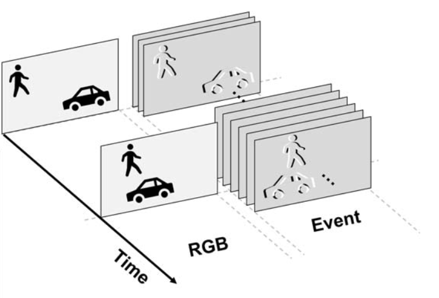

In [Part 1](https://lenzgregor.com/posts/event-cameras-2025-part1/) I provided a high level overview of different industry sectors that could potentially see the adoption of event cameras. Apart from the challenge of finding the right application, there are several technological challenges before event cameras can reach a mass audience. 

## Sensor Capabilities
Today's commercially available event cameras are summarised in the table below.

| Camera Supplier | Sensor | Model Name | Year | Resolution | Dynamic Range (dB) | Max Bandwidth (Mev/s) |
|-----------------|--------|------------|------|------------|-----------|-----------------------|
| iniVation       | Samsung | [DVXPlorer](https://docs.inivation.com/hardware/current-products/dvxplorer.html) | 2020 | 640 × 480 |  | 165  |
| Prophesee       | [Sony IMX636](https://www.prophesee.ai/event-based-sensor-imx636-sony-prophesee/) | [EVK4](https://www.prophesee.ai/event-camera-evk4/) | 2020 | 1280 × 720 | 120 | 1066  |
| Prophesee       |  [GenX320](https://www.prophesee.ai/event-based-sensor-genx320/) | [EVK3](https://www.prophesee.ai/evk-3-genx320-info/) | 2023 | 320 × 320 | 140 |  |
| Samsung         |  | DVS-Gen4 | 2020 | 1280 × 960 |  | 1200 |

Insightness was sold to Sony, CelePixel partnered with Omnivision, but hasn't released anything in the past 5 years. Over the past decade, we have seen resolution grow from 128x128 to HD, but that's actually not always good. The last column in the table above describes the number of million events per second, which can easily be reached when the camera is moving fast, such on a drone. A paper by [Gehrig and Scaramuzza](https://arxiv.org/abs/2203.14672) suggests that in low light and high speed scenarios, performance of high res cameras is actually worse than when using fewer, but bigger pixels, due to high per-pixel event rates that are noisy and ghosting artifacts.  
I think that in areas such as defence, higher resolution and contrast sensitivity, as well as capturing the infrared spectrum, is going to be desirable, because range is so important. SCD USA made the [MIRA 02Y-E](https://scdusa-ir.com/wp-content/uploads/2024/06/Mira_V1g.pdf) available last year that includes an optional event-based readout, to enable tactical forces to detect laser sources. Using the event-based output, it can reach up to 1.2 kHz of frame rate. 
Similarly in space, the distances to the captured objects are enormous. 
In short range applications for wearables, a GenX320 at lower resolution but high dynamic range and low power modes is going to be more interesting. 
For scientific applications, NovoViz recently [announced](https://www.tokyoupdates.metro.tokyo.lg.jp/en/post-1551/) a new SPAD (single photon avalanche diode) camera using event-based outputs!

Today’s event cameras output binary spikes at microsecond resolution. But this temporal resolution is useless for most embedded applications such as gesture recognition or face detection. Much like Intel’s [Loihi 2](https://open-neuromorphic.org/neuromorphic-computing/hardware/loihi-2-intel/) shifted from binary spikes to richer spike payloads because they realised that the communication overhead was too high otherwise, future event cameras could emit multi-bit “micro-frames” or tokenizable spike packets. These would represent short-term local activity and could be directly ingested by ML models, reducing the need for preprocessing altogether. Ideally there’s a trade-off between information density and temporal resolution that can be chosen. We're also seeing new hybrid vision sensors, combining frames and events, being designed. At ISSCC 2023, three papers ([one](https://ieeexplore.ieee.org/document/10067520), [two](https://ieeexplore.ieee.org/document/10067566), and [three](https://ieeexplore.ieee.org/document/10067476)) were released that showed *event frames* at variable rate being output next to fixed RGB outputs.
In either case, the event camera sensor has not reached its final form yet. Event-only sensors might move from binary outputs toward richer encodings at the pixel level, attach a dedicated processor to output richer representations, or they simply output what the world already knows well: another form of frames. Often, the simplest solutions win, so it might well the the latter.

*[Kodama et al.](https://ieeexplore.ieee.org/document/10067520) presented a sensor that outputs variable event frame rates next to RGB.* 

## Output Representation
A common approach is to aggregate events into [image-like representations](https://tonic.readthedocs.io/en/latest/auto_examples/index.html#event-representations) such as 2d histograms, voxel grids, or time surfaces. These are then fed into standard deep learning models that were trained on images. This leverages the breadth of existing tooling built for images and is compatible with GPU-accelerated training and inference. Moreover, it allows for adaptive frame rates, aggregating only when there’s activity and potentially saving on compute. However, this method discards much of the fine temporal structure that makes event cameras valuable in the first place. It’s also inherently inefficient: the tensors produced are full of zeros, and latency grows with the size of the memory window. This becomes problematic for real-time applications where a long temporal context is needed but high responsiveness is crucial.

This leads to what I see as the central technical bottleneck: we still lack a representation for event streams that works well with transformer-based architectures and preserves their sparsity. In my opinion, event streams are a new data modality, just like images, audio, or text, but one for which we haven’t yet cracked the “tokenization problem.” A single ON or OFF event contains very little semantic information. Unlike a word in a sentence, which can encode a concept, even a dozen events reveal almost nothing about the scene. This makes direct tokenization inefficient and ineffective. What we need is a representation that can summarize local spatiotemporal structure into meaningful, higher-level primitives. Something akin to a “visual word” for events.

I think that graphs, especially dynamic, sparse graphs, are an interesting abstraction to be explored. Each node could represent a small region of correlated activity in space and time, with edges encoding temporal or spatial relationships. Recent work such as [HugNet v2](https://openaccess.thecvf.com/content/CVPR2025/html/Dampfhoffer_Graph_Neural_Network_Combining_Event_Stream_and_Periodic_Aggregation_for_CVPR_2025_paper.html), [DAGr](https://www.nature.com/articles/s41586-024-07409-w), or [EvGNN hardware](https://ieeexplore.ieee.org/abstract/document/10812004) apply Graph Neural Networks (GNNs) to event data. But a fundamental challenge remains: even to generate such a graph, we still need to process the entire event stream. This is where specialized hardware accelerators will need to come in, because dynamically fetching events is expensive. By combining event cameras with efficient “graph processors,” we could offload the task of building sparse graphs directly on-chip, producing representations that are ready for downstream learning. Temporally sparse, graph-based outputs could serve as a robust bridge between raw events and modern ML architectures.

## Machine Learning Models
At their core, event cameras are change detectors, which means that we need some sort of memory during the processing. There are two main strategies to handle this. The first approach is the aggregation of inputs before it is fed to the AI accelerator.

A more scalable approach is to bake memory into the model architecture itself using recurrence or attention. For example, [Recurrent Vision Transformers](https://openaccess.thecvf.com/content/CVPR2023/html/Gehrig_Recurrent_Vision_Transformers_for_Object_Detection_With_Event_Cameras_CVPR_2023_paper.html) and their variants maintain internal state across time and can handle temporally sparse inputs more naturally. These methods preserve temporal continuity, but there’s a catch: most of these methods still rely on dense, voxelized inputs. Even with more efficient [state-space models](https://openaccess.thecvf.com/content/CVPR2024/html/Zubic_State_Space_Models_for_Event_Cameras_CVPR_2024_paper.html) replacing LSTMs and BPTT (Backpropagation Through Time), we’re still processing mostly zeros. Training is faster, but inference is still bottlenecked by inefficient representations.

## Processors

## Conclusion
Here are my main points:
* Event cameras won’t go mainstream until we have an efficient representation that is compatible with modern ML architectures.
* Richer output formats, whether from the sensor or an attached preprocessor, are essential.

* Biologically-inspired approaches should not distract from deployment-grade ML solutions.

I think that interesting research directions for event cameras today are about dynamic graph representations for efficient tokenization, state space models for efficient inference, lossy compression for smaller file sizes. To unlock the full potential of event cameras, we need to solve the representation problem to make it compatible with modern deep learning hardware and software, while preserving the extreme sparsity of the data. If we continue processing the zeros, we won’t beat standard cameras. Also we shouldn’t be too focused on biologically-inspired processing if we want this thing to scale anytime soon. I think that either the sensors must evolve to emit richer, token-friendly outputs, or they must be paired with dedicated pre-processors that produce high-level, potentially graph-based abstractions. Once that happens, event cameras become easy enough to work with to reach the mainstream. 
