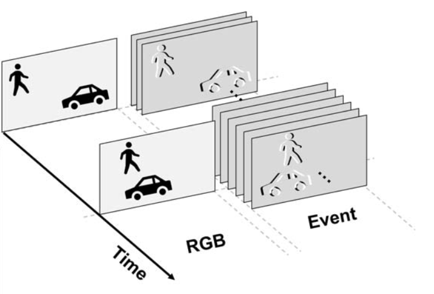
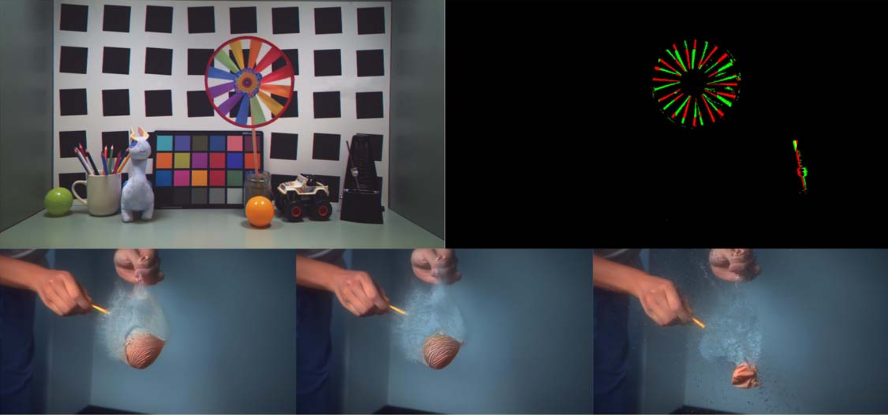

In [Part 1](https://lenzgregor.com/posts/event-cameras-2025-part1/) I provided a high level overview of different industry sectors that could potentially see the adoption of event cameras. Apart from the challenge of finding the right application, there are several technological challenges before event cameras can reach a mass audience. 

## Sensor Capabilities
Today's most recent event cameras are summarised in the table below.

| Camera Supplier | Sensor | Model Name | Year | Resolution | Dynamic Range (dB) | Max Bandwidth (Mev/s) |
|-----------------|--------|------------|------|------------|-----------|-----------------------|
| iniVation       | Gen2 DVS | [DAVIS346](https://docs.inivation.com/hardware/current-products/davis346.html) | 2017 | 346×260 | ~120 | 12 |
| iniVation       | Gen3 DVS | [DVXPlorer](https://docs.inivation.com/hardware/current-products/dvxplorer.html) | 2020 | 640×480 | 90-110 | 165  |
| Prophesee       | [Sony IMX636](https://www.prophesee.ai/event-based-sensor-imx636-sony-prophesee/) | [EVK4](https://www.prophesee.ai/event-camera-evk4/) | 2020 | 1280×720 | 120 | 1066 |
| Prophesee       | [GenX320](https://www.prophesee.ai/event-based-sensor-genx320/) | [EVK3](https://www.prophesee.ai/evk-3-genx320-info/) | 2023 | 320×320 | 140 |  |
| Samsung         | Gen4 DVS | DVS-Gen4 | 2020 | 1280×960 |  | 1200 |

Insightness was sold to Sony, and CelePixel partnered with Omnivision, but hasn't released a product in the past 5 years. Over the past decade, we have seen pixel arrays grow from 128x128 to 1280x720 (Prophesee's HD sensor), but higher resolution is actually not always desirable. The last column in the table above describes the maximum number of million events per second that the sensor can handle, which results in GB/s of data for fast moving scenes. In addition, a paper by [Gehrig and Scaramuzza](https://arxiv.org/abs/2203.14672) suggests that in low light and high speed scenarios, performance of high res cameras is actually worse than when using fewer, but bigger pixels, due to high per-pixel event rates that are noisy and cause ghosting artifacts.  

As you can see from the table above, most of today's event sensors are based on designs from 5 years ago. Different sectors have their own requirements depending on the application, so there are new designs underway. 
In areas such as defence, higher resolution and contrast sensitivity, as well as capturing the short/mid range infrared spectrum, is vital because range is so important. SCD USA made the [MIRA 02Y-E](https://scdusa-ir.com/wp-content/uploads/2024/06/Mira_V1g.pdf) available last year that includes an optional event-based readout, to enable tactical forces to detect laser sources. Using the event-based output, it advertises a frame rate of up to 1.2 kHz. 
In space, the distances to the captured objects are enormous, and therefore high resolution and light sensitivity are of utmost importance.
As mentioned in [Part 1](https://lenzgregor.com/posts/event-cameras-2025-part1/), there are now companies focusing on building event sensors for aerospace and defence, given the growing allocation of resources in that sector. 

In short range applications such as eye tracking for wearables, a sensor at lower resolution but high dynamic range and ultra low power modes is going to be more relevant. Prophesee's [GenX320](https://www.prophesee.ai/event-based-sensor-genx320/) is designed for that.  
For scientific applications, NovoViz recently [announced](https://www.tokyoupdates.metro.tokyo.lg.jp/en/post-1551/) a new SPAD (single photon avalanche diode) camera using event-based outputs, where outputing full frames would be way too costly. 

Over the next years we'll see new designs emerging, although I would argue that two decades of research using the binary event output format has mostly resulted in converting events to some form of image representation, in order to apply the tools and frameworks that are already mature.
I think that's why we're seeing new hybrid vision sensors emerging, which try to rethink the event output format. At ISSCC 2023, two of three papers presenting new sensors showed the introduction of asynchronous _event frames_. 

| Sensor                        | Event output type                                 | Timing & synchronization                    | Polarity info              | Typical max rate |
|--------------------------------|----------------------------------------------------|-----------------------------------------------|----------------------------|------------------|
| [Sony 2.97 μm](https://ieeexplore.ieee.org/document/10067566)          | Binary event frames (two separate ON/OFF maps)    | Synchronous, ~580 µs “event frame” period    | 2 bits per pixel (positive & negative) | ~1.4 GEvents/s |
| [Sony 1.22 μm, 35.6 MP](https://ieeexplore.ieee.org/document/10067520) | Binary event frames with row-skipping & compression | Variable frame sync, up to 10 kfps per RGB frame | 2 bits per pixel (positive & negative) | Up to 4.56 GEvents/s |
| [OmniVision 3-wafer](https://ieeexplore.ieee.org/document/10067476)    | Per-event address-event packets (x, y, t, polarity) | Asynchronous, microsecond-level timestamps    | Single-bit polarity per event | Up to 4.6 GEvents/s |

The Sony 2.97 μm chip uses aggressive circuit sharing so that four pixels share one comparator and analog front-end. Events are not streamed individually but are batched into binary event frames every ~580 µs, with separate maps for ON and OFF polarity. This design keeps per-event energy extremely low (~57 pJ) and allows the sensor to reach ~1.4 GEvents/s without arbitration delays. The event output is already frame-like, and thus fits naturally into existing machine learning pipelines that expect regular image-like input at deterministic timing. 

The Sony 1.22 μm hybrid sensor aimed at mobile devices combines a huge 35.6 MP RGB array with a 2 MP event array. Four 1.22 µm photodiodes form each event pixel (4.88 µm pitch). The event side operates in variable-rate event-frame mode, outputting up to 10 kfps inside each RGB frame period. On-chip event-drop filters and compression dynamically reduce data volume while preserving critical motion information for downstream neural networks (e.g. deblurring or video frame interpolation). To me the asynchronous data capture of _event frames_ that encode change seems like a practical way forward. I still think that frames rates up to 100 Hz would probably be fine though. 

*[Kodama et al.](https://ieeexplore.ieee.org/document/10067520) presented a Sony 1.22 μm hybrid sensor that outputs variable-rate binary event frames next to RGB.* 

The OmniVision 3-wafer is closer to the classic DVS concept but shows what's possible: A dedicated 1MP event wafer with in-pixel time-to-digital converters stamps each event with microsecond accuracy. Skip-logic and four parallel readout channels give an impressive 4.6 GEvents/s throughput. It's good for ultra-fast motion analysis or scientific experiments where every microsecond matters.

*[Guo et al.](https://ieeexplore.ieee.org/document/10067476) presented a new generation of hybrid vision sensor that outputs binary events.*

I think that today’s binary microsecond spikes are rarely the right format for most applications. Much like Intel’s [Loihi 2](https://open-neuromorphic.org/neuromorphic-computing/hardware/loihi-2-intel/) shifted from binary spikes to richer spike payloads because they realised that the communication overhead was too high otherwise, future event cameras are becoming more practical by exploring frame-like representations. They could also emit something in between binary events and frames, such as multi-bit “micro-frames” or tokenizable spike packets. These would represent short-term local activity and could be directly ingested by ML models, reducing the need for preprocessing altogether. 

Ideally there’s a trade-off between information density and temporal resolution that can be chosen depending on the application. 
In either case, the event camera sensor has not reached its final form yet. People are still experimenting with ways how events should be represented in order to be compatible with modern machine learning methods. 

## Event Representations
Most common approaches aggregate events into [image-like representations](https://tonic.readthedocs.io/en/latest/auto_examples/index.html#event-representations) such as 2d histograms, voxel grids, or time surfaces. These are then used to fine-tune deep learning models that were pre-trained on RGB images. This leverages the breadth of existing tooling built for images and is compatible with GPU-accelerated training and inference. Moreover, it allows for adaptive frame rates, aggregating only when there’s activity and potentially saving on compute in case there's little activity in the scene. However, this method discards much of the fine temporal structure that event cameras provide today. 
It’s also inefficient: the tensors produced are full of zeros, and in order to get sufficient signal, you have to accumulate for hundreds of miliseconds if you're capturing a slow activity. This becomes problematic for real-time applications where a long temporal context is needed but high responsiveness is crucial.

We still lack a representation for event streams that works well with modern ML architectures while preserving their sparsity. Event streams are a new data modality, just like images, audio, or text, but one for which we haven’t yet cracked the “tokenization problem”. At first sight, an event stream, one event after the other, is a perfect match for today's capable sequence models. But a single binary event contains very little semantic information. Unlike a word in a sentence, which can encode a complex concept, even a dozen binary events reveal almost nothing about the scene. This makes direct tokenization of events inefficient and ineffective. What we need is a representation that can summarize local spatiotemporal structure into meaningful, higher-level primitives, to represent event streams as a sequence of tokens that is directly dependent on activity in the scene.

I think that graphs, especially dynamic, sparse graphs, are an interesting abstraction to be explored. Each node could represent a small region of correlated activity in space and time, with edges encoding temporal or spatial relationships. Recent work such as [HugNet v2](https://openaccess.thecvf.com/content/CVPR2025/html/Dampfhoffer_Graph_Neural_Network_Combining_Event_Stream_and_Periodic_Aggregation_for_CVPR_2025_paper.html), [DAGr](https://www.nature.com/articles/s41586-024-07409-w), or [EvGNN hardware](https://ieeexplore.ieee.org/abstract/document/10812004) apply Graph Neural Networks (GNNs) to event data. But several challenges remain: to generate such a graph, we need a lot of memory for all those events, and the upredictable number of incoming events makes computation extremely inefficient. This is where specialized hardware accelerators will need to come in, because dynamically fetching events is expensive. By combining event cameras with efficient “graph processors,” we could offload the task of building sparse graphs directly on-chip, producing representations that are ready for downstream learning. Temporally sparse, graph-based outputs could serve as a robust bridge between raw events and modern ML architectures.

% hybrid representations

If you want to preserve sparsity while at the same time managing the large amount of events, you need a highly compressed representation. Individual ON/OFF events are too atomic to be useful tokens, so a practical middle ground is a two‑stage model: a lightweight, streaming “tokenizer” that clusters local spatiotemporal activity into short‑lived micro‑features, followed by a stateful temporal model that reasons over those features. Training could happen from scratch in a self-supervised fashion, and wouldn't need to rely on models that had been trained on images. 
Either way, the goal is to transform a flood of spikes into a bounded, variable‑rate set of tokens with stable meaning. Next let's explore the type of models that work well with event camera data.

## Models
At their core, event cameras are change detectors, which means that we need memory in our machine learning models to remember where things were before they stopped moving. 
We can bake memory into the model architecture by using recurrence or attention. For example, [Recurrent Vision Transformers](https://openaccess.thecvf.com/content/CVPR2023/html/Gehrig_Recurrent_Vision_Transformers_for_Object_Detection_With_Event_Cameras_CVPR_2023_paper.html) and their variants maintain internal state across time and can handle temporally sparse inputs more naturally. These methods preserve temporal continuity, but there’s a catch: most of these methods still rely on dense, voxelized inputs. Even with more efficient [state-space models](https://openaccess.thecvf.com/content/CVPR2024/html/Zubic_State_Space_Models_for_Event_Cameras_CVPR_2024_paper.html) replacing LSTMs and BPTT (Backpropagation Through Time) with much faster training strategies, we’re still processing a lot of zeros. Training is faster, but inference is still bottlenecked by inefficient representations.

### Asynchronous Models
Moreover, truly event-by-event pipelines remain challenging: the best systems still batch events into micro-frames or voxel grids before streaming the SSM state. This is acceptable and aligns with the sensor trend toward event frames and with practical GPU execution.

### Graph Neural Networks   

### State-space Models

Following the success of [VMamba](https://arxiv.org/abs/2401.10166) for RGB inputs, state-space models (SSMs) approach perception as a continuous-time dynamical system with a compact hidden state that can be discretized at any step size. This flexibility is particularly valuable for event cameras, because it allows you to train at one input rate and deploy at another simply by changing the integration step, without needing to retrain. SSMs maintain a cheap, always-on scene state that updates with each micro-batch of activity, which is particularly advantageous on embedded systems to save memory. They also scale linearly in sequence length so you can extend temporal context without exploding compute. 

[Zubić and colleagues]() show that combining S4/S5-style SSM layers with a lightweight Vision Transformer backbone leads to faster training that is about a third quicker than RNN-based recurrent transformers, and much smaller accuracy loss when the input frequency at deployment is higher than during training. 

[XX et al.] introduced SMamba, which builds on the Mamba/SSM idea and adds adaptive sparsification. By estimating spatio-temporal continuity, it discards blank or noisy tokens, prioritizes scans so informative regions interact earlier, and mixes channels through a global channel interaction step. On datasets such as Gen1, 1Mpx, and eTram, this approach reduces FLOPs by roughly 22–31 % relative to its dense baseline while slightly improving mAP, showing that it is possible to keep global modeling while avoiding computation on dead zones that dominate event inputs. 

For optical flow, a spatio-temporal SSM encoder with convex upsampling can estimate dense flow from a single event volume, bypassing RAFT-style iterative refinement. This method achieves about 4.5 times faster inference and roughly eight times fewer MACs than a recent iterative method (TMA) while maintaining competitive endpoint error (EPE) on DSEC and being about twice as efficient as EV-FlowNet, illustrating that SSMs can replace costly recurrence while preserving temporal precision. 

[PRE-Mamba]()s approach is interesting because it turns the event camera's weakness of generating large amounts of data for dynamic scenes into a benefit. The authors use a multi-scale SSM inside a point-based pipeline over a 4D event cloud for weather-robust event deraining. The key archicture lesson is that minimal spatio-temporal clustering combined with an SSM can carry long temporal context efficiently and with a small parameter footprint. 

From these findings, several practical guidelines emerge for building with SSMs. They make it feasible to train once and deploy anywhere along the time axis: if a system must run at 10 Hz in the lab and 100 Hz on-device, it is enough to rescale the discretization step without any fine-tuning. In terms of architecture, the most stable pattern across papers is to use an SSM for temporal aggregation paired with a lightweight spatial mixer, such as local attention or a convolution, which preserves long memory without incurring transformer-scale spatial costs. Efficiency can be improved by exploiting sparsity without sacrificing global context: instead of relying on purely local or windowed attention, prune tokens based on spatio-temporal continuity, discard obvious background or noise, and still scan globally over what remains, following the SMamba strategy. For deployment, diagonal or parallel-scan variants such as S4D, S5, or Mamba-style selective scans are recommended because they run naturally in streaming mode and performed reliably across rates and tasks. SSMs also work best when fed with appropriately chosen sequences or “tokens.” All the referenced works use short event windows—voxel grids, micro-frames, or serialized patches—so some batching is healthy at high event rates. Latency remains low by keeping these windows small and adaptive.

SSMs are particularly suitable for high-speed tasks like flow and tracking, where long context with linear compute is needed; for detection under rate shifts such as dynamic frame times or variable motion, where frequency-agnostic behavior and faster training help; and for sparse, mostly quiet scenes, where selective computation over active regions can be achieved without losing the global view. There are, however, a few cautions. SSMs are not a complete solution for spatial reasoning and still require a lightweight spatial mixer to handle large, slow movers and high-resolution scenes. 

For event vision, SSMs provide an effective “scene memory” primitive that is compact, fast, and tolerant to variable timing. The emerging recipe that scales well is to use small adaptive windows, add light spatial mixing, apply an SSM for temporal modeling, and optionally incorporate sparsification to skip inactive regions. This combination keeps latency low when activity is sparse and allows you to increase batch size during heavy traffic without rewriting the model or retraining for different rates.

### Spiking neural networks
Spiking neural networks (SNNs) are sometimes touted as a natural fit for event data. But in their traditional form, with binary activations and reset mechanisms, leaky integrate-and-fire (LIF) neurons are handcrafted biological abstractions. If we learned anything from machine learning, it's that handcrafted designs are extremely biased. And neurons are an incredibly complex thing to model, as efforts such as [CZI’s Virtual Cells](https://chanzuckerberg.com/science/technology/virtual-cells/) and [DeepMind’s cell simulations](https://analyticsindiamag.com/ai-features/inside-google-deepminds-bold-vision-for-virtual-cell/) show. 
Deep learning started out with 32 bit floating point, dense representations, and neuromorphic started out on the other end of the spectrum at binary, extremely sparse representations. They are converging, with neuromorphic realising that binary events are expensive to transmit and process, and deep learning embracing 4 bit activations and 2:4 sparsity. 
A recent paper proposes [binary neural networks](https://arxiv.org/abs/2509.07025), which shows that the research community is surprisingly resistent to the learnings of the past.
I think that the most impressive research on event cameras comes out of labs that embrace classic computer vision and adapt it to the new modality. 
So let's not get hung up on the artificial neuron model itself, and instead use what works well, because the field is moving incredibly fast. 

% 
Nowadays larger AI models are being pruned, distilled, and quantised to provide efficient edge models that can generalise well. Even TinyML models are [students](https://www.nature.com/articles/s41598-025-94205-9.pdf) of a larger model. We have to say goodbye to the idea of training tiny models from scratch for commercial event camera applications, because they won't perform well enough in the real world. 

## Processors
Meyer et al. implemented a S4D SSM on Intel’s Loihi 2, constraining the state space to be diagonal so that each neuron evolves independently.
They mapped these one-dimensional state updates directly to Loihi’s programmable neurons and carefully placed layers to reduce inter-core communication, which resulted in much lower latency and energy use than a Jetson GPU in true online processing. 
I think it’s a compelling demonstration that SSMs can be run efficiently on stateful AI accelerator hardware and I'm curious what else is coming out of that. 

Some people argue that because event cameras output extremely sparse data, we can save energy by skipping zeros in the input or in intermediate activations. But I don't buy that argument because while the input might be much sparser than an RGB frame, the bulk of the computation actually happens in intermediate layers and works with higher level representations, which are hopefully similar for both RGB and event inputs. That means that in AI accelerators we can't exploit spatial event camera sparsity, and inference cost between RGB and event frames are essentially the same. Of course we might get different input frame rates / temporal sparsity, but those can be exploited on GPUs as well. 

Keep in mind that on mixed-signal hardware, rules are different. There's a breadth of new materials being explored, memristors and spintronics. The basic rule for analog is: if you need to convert from analog to digital too often, for error correction or because you're storing states or other intermediate values, your efficiency gains go out of the window. [Mythic AI](https://mythic.ai/) had to painfully learn that and [almost tanked](https://www.reddit.com/r/technology/comments/yvjgwu/analog_ai_chip_startup_mythic_runs_out_of_money/), and also [Rain AI](https://rain.ai/) pivoted from its original analog hardware and faces [an uncertain future](https://startupwired.com/2025/05/16/rain-ai-the-rise-and-fall-of-a-chipmaking-challenger/). The brain uses a mixture of analog (graded potentials, dendritic integration) and digital (spikes) signals and we can replicate this principle in silicon. But since the circuitry is the memory at the same time, it needs an incredible amount of space, and is organised in 3d. That's really costly to do in silicon, and the major challenge is getting the heat out, which is much easier in 2d. 

I think that the asynchronous compute principle is key for event cameras, but we need to realise that naïve asynchrony is not constructive. Think about a roundabout, and how it manages the flow of traffic without any traffic lights. When the traffic volume is low, every car is more or less in constant motion, and latency to cross the roundabout is minimal. As the volume of traffic grows, a roundabout becomes inefficient, because the movement of any car depends on the decisions of cars nearby. For high traffic flow, it becomes more efficient to use traffic lights to `batch process` the traffic for multiple lanes at once, which achieves the highest throughput of cars.
The same principle applies for events. When you have few pixels activated, you achieve the lowest latency when you process them as they come in, as in a roundabout. But as the amount of events / s gets larger, for example because you're moving the camera on a car or a drone, you need to get out the traffic lights, and start and stop larger batches of events. Ideally the size of the batch depends on the event rate. 

For more info about neuromorphic chips, I refer you to [Open Neuromorphic's Hardware Guide](https://open-neuromorphic.org/neuromorphic-computing/hardware/).

## Conclusion
Here are my main points:
* Event cameras won’t go mainstream until they move away from binary events and to richer output formats, whether from the sensor directly or an attached preprocessor.
* Event cameras follow the trajectory of other sensors that were developed and improved within the context of defence applications. 
* We need an efficient representation that is compatible with modern ML architectures. It might well be event frames in the end. 
* Keep it practical. Biologically-inspired approaches should not distract from deployment-grade ML solutions.

If I had to place a bet on the most likely path to successful commercialisation today, I'd say it'll be hybrid event cameras that combine variable event frames with regular RGB input, turned into a sparse token stream that feeds into a state-space model on an embedded GPU or other specialised embedded edge processor. 

We'll probably want to sacrifice some of that high temporal resolution on the sensor level to get better aggregate information that can be further compressed. 
An event sensor doesn't need to make pretty, human readable pictures, but it should be geared towards easy processing on *today's* AI hardware, that is, GPUs. Targeting machine learning applications, resolution can stay around something like VGA (640x480 pixels) and outputs (partial) frames that encode spatiotemporal information. 

The recipe that scales is: build a token stream that carries meaning, train it with cross‑modal supervision and self‑supervision that reflects real sensor noise, keep a compact scene memory that is cheap to update, and make computation conditional on activity rather than on a fixed clock.

Binary events don't contain enough information on their own, so they must be aggregated in one form or another. Event sensors might move from binary outputs toward richer encodings at the pixel level, attach a dedicated processor to output richer representations, or they simply output what the world already knows well: another form of frames. While many researchers (including me) originally set out to work with binary events directly, I think it is time to swallow a bitter pill and accept that computer vision will depend on frames for the foreseeable future.  
My bet is currently on the latter, because the simplest solutions tend to win. 

Interesting research directions for event cameras today are about dynamic graph representations for efficient tokenization, state space models for efficient inference, lossy compression for smaller file sizes. To unlock the full potential of event cameras, we need to solve the representation problem to make it compatible with modern deep learning hardware and software, while preserving the extreme sparsity of the data. 
Also we shouldn’t be too focused on biologically-inspired processing if we want this thing to scale anytime soon. I think that either the sensors must evolve to emit richer, token-friendly outputs, or they must be paired with dedicated pre-processors that produce high-level, potentially graph-based abstractions. Once that happens, event cameras become easy enough to work with to reach the mainstream. 

Ultimately, the application dictates the design. Gesture recognition does not need microsecond temporal resolution. Eye tracking doesn't need HD spatial resolution. And sometimes a motion sensor that will wake a standard camera will be the easiest solution. 

