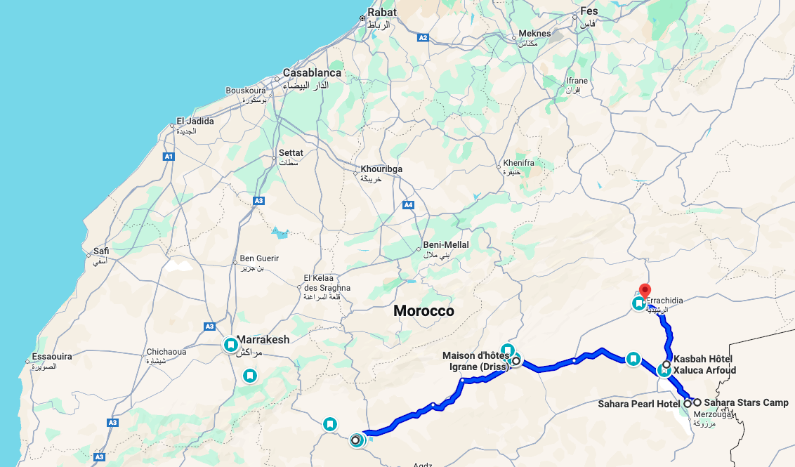
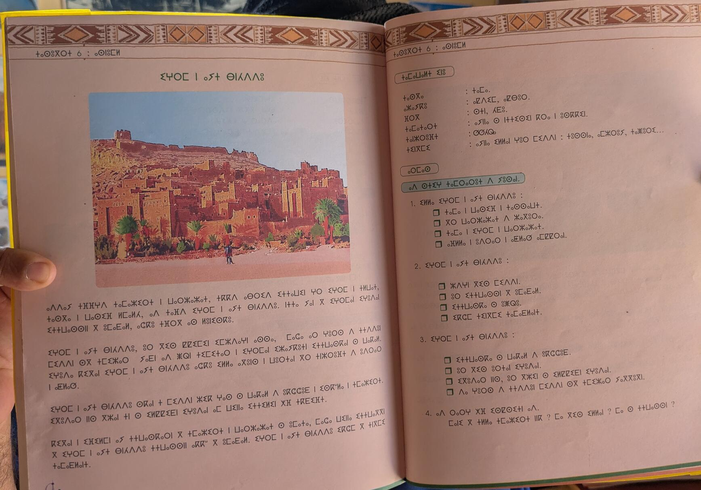
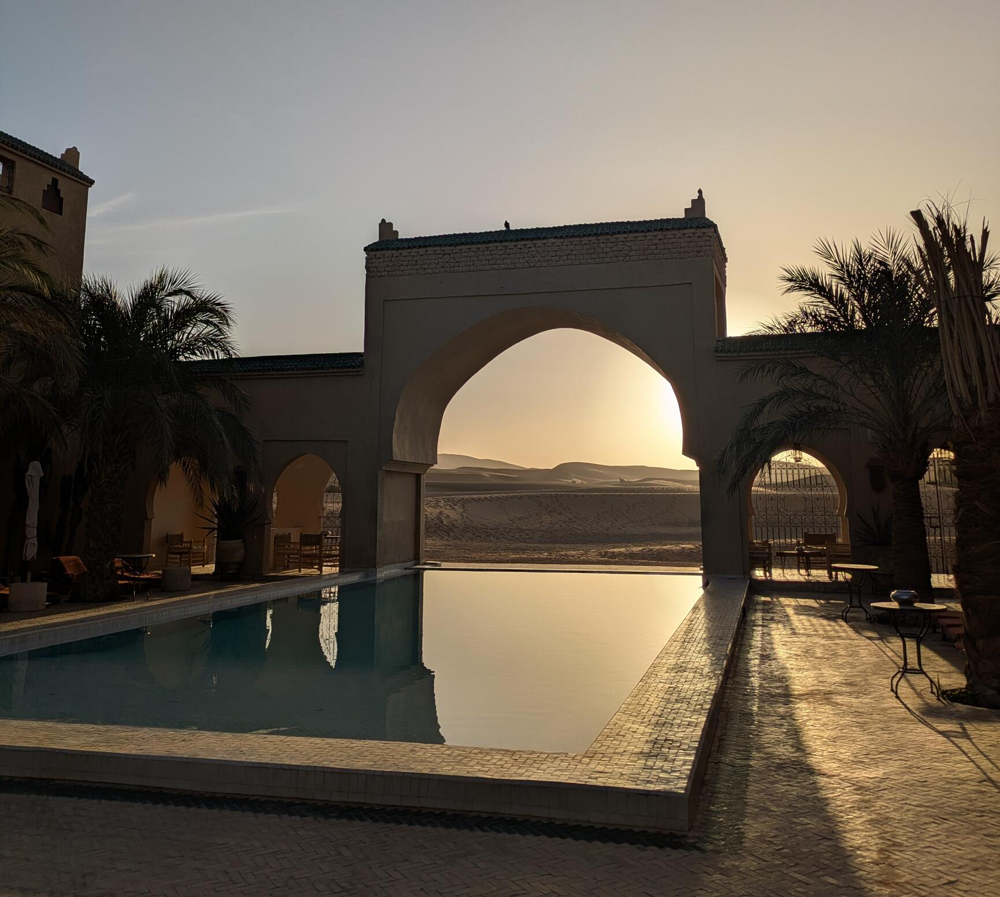
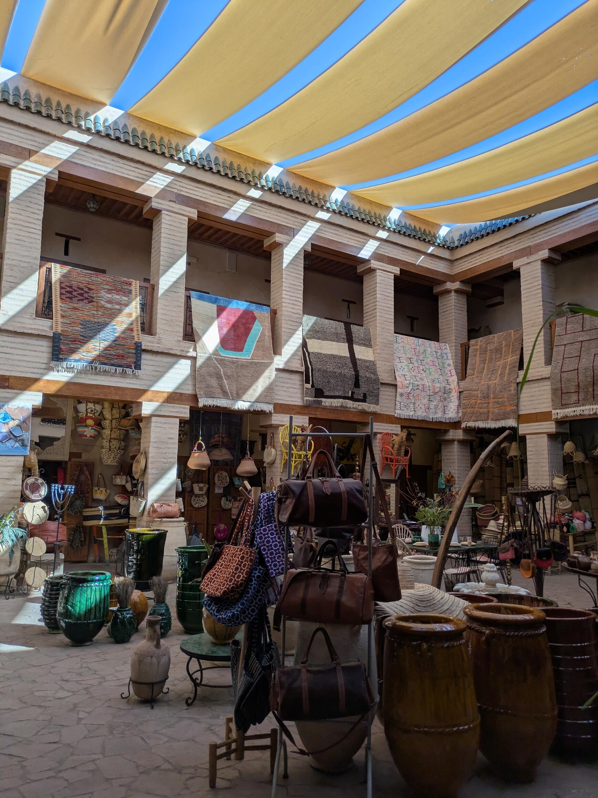

When I was 22, I went to New Zealand with my dad and experienced one of the most memorable star gazing nights on Mount Cook, with stars visible down to the horizon, in the clear skies of a no flight zone. It was magical, and I wanted to do something similar with my wife. Star gazing is best done in remote places, and because I had never been to the African continent, I thought why not go to the desert? I looked up the date for New Moon, when the night is darkest, 6 months in advance. This is how our trip to the Moroccan desert came about. 

From London, we flew directly to Ouarzazate, which is east of the Atlas mountains. In our rented car from [Zizdra Tours](https://zizdratours.com/#), which we were very happy with, we drove via Tinghir to Merzouga, to make our way to the Sahara via the _route of 1000 Kasbahs_, which are traditional fortresses, often made of earth and clay, that served as residences for leaders and defenses against invasions between the 17th to 19th century. You can find a [list](https://maps.app.goo.gl/TNmGZPe5RD9PrQPf8?g_st=ac) of all the hotels we stayed at and places we visited.  

*Our [route](https://maps.app.goo.gl/dY68ydCaDhZusHCD9) from Ouarzazate to Errachidia by car in 8 days. It was about 500km in total.*

## Ouarzazate - lots of Kasbahs
Luckily for us London dwellers, there's a direct Ryanair flight to Ouarzazate, which is quite a drastic change of scenery. Taking off at the warehouse that is Stansted in cold weather, on a flight that was at ~15% capacity, you step on the tarmac to sunshine and 25 degrees at a tiny airport. If you happen to fly there as well, make sure you buy and install your esim before takeoff, as there's no wifi at the airport and mobile data roaming costs are exorbitant. For the night, we stayed at [Berbère Palace](https://maps.app.goo.gl/oxW4jaTxobUo8JUX8), where we ordered 2 couscous and a salad, but what they brought us was food for two days!  

From Ouarzazate it's about a 40 minute drive to [Aït Benhaddou](https://maps.app.goo.gl/p2U7Wmh3oyYtQAvh7), a Berber castle that is a UNESCO World Heritage site. Scenes from both Gladiator and a dozen other movies were filmed there. It was impressive to see, and full of local artists that exhibited their artworks. We hired a local guide for 200 Dirham (~20 Euros), to show us around and explain the rich history of the Kasbah.

*The impressive Aït Benhaddou Kasbah, a UNESCO World Heritage site where many movies have been filmed.*

The second Kasbah we visited was [Taourirt](https://maps.app.goo.gl/2v7Z27zEYQn5T6nX6), directly in Ouarzazate, again with a local guide. It was under renovation because of an earthquake in 2023. He told us about how the Amazigh, the people living in the area before the Arabs arrived, became known as Berber, and the multitude of French, Arabic and Amazigh culture, while sharing a cup of mint tea. Did you know that in Morocco they use three alphabets? Arabic, Latin, and Tamazight.

*Tamazight, with its own alphabet, is spoken in Amazigh (Berber) communities across Morocco, Algeria, Tunisia, Libya, and parts of Mauritania.*

In town, my wife found a wonderfully decorated [French restaurant](https://maps.app.goo.gl/PYYQKVRxR3W3SQpC7) with an indoor pool and great food. After some days of eating tagine and couscous, it was a welcome change. 

## Tinghir - beautiful palm groves 
About a 2.5h drive to the east, in an oasis, is Tinghir, a remote town with beautiful palm groves. We stopped at a peaceful [café with a fish pond](https://maps.app.goo.gl/pWy6PrqDXQg52Uku7) from which we went on an idyllic hike in the shadows of palm trees, crossing a river, walking through the ruins of an abandoned kasbah, and returning to the cafe for some sweet mint tea. It was one of those serendipitous encounters, and I highly recommend it if you make it to Tinghir. Close by, another walk took us through the impressive [Todgha gorge](https://maps.app.goo.gl/N56djVt13mZ3ui1u7) with cliffs 300m high on either side. Back at the hotel, we joined the hotel staff playing traditional Berber music in the evening. Because I knew a bit of percussion, we immediately bonded, so before leaving the hotel, they surprised us with an authentic Moroccan experience by making us wear their traditional wedding outfits, so we could get married a second time! The staff at [Maison d'hôte Igrane](https://maps.app.goo.gl/ceWmVgeKCfF2QVDc6) was incredibly friendly and made the stay in Tinghir feel like an authentic experience.

*My wife posing in the midst of the ruins of a kasbah, just next to a beautiful palm grove.*

## Merzouga and desert camp
We then drove another 2.5h towards Merzouga. Our destination was the [Sahara Pearl](https://maps.app.goo.gl/NzeNGQrVF8fVczNRA) hotel which is located at the border to the Sahara, and offers postcard views of a scenery that could be in Aladdin. This was the best hotel we stayed at, because of its breathtaking views in combination with a modern room (the hotel was built in 2024). We rode camels, sandboarded, and watched the sun rise and set, casting dramatic shadows on the dunes. Most of the time we just chilled at the pool though and ordered food!

*View from the hotel pool at the Sahara Pearl hotel, which borders the Erg Chebbi sand dunes of the Sahara.*

Then finally came our night at the Sahara Stars desert camp, during new moon. After a 30 minute camel ride with 4x4s racing past to move luggage and goods to and from the camp, we arrived at a tent village, with private bathrooms, air conditioning and a restaurant. I have to say that I expected a more intimate setting with a few tents, but our camp was one of many in the area, which didn't make it feel as secluded as I thought, but in exchange the amenities were decent. After the lights went out at 11pm, it was star gazing time, and lying on top of a dune, I watched the beautiful night sky, with artificial lights from human civilisation only visible in the far distance. It felt very magical! I took the photo below with my phone using a 4 minute exposure, leaning against a chair. It turned out not bad, I think!

<video controls width="100%">
  <source src="photos/stars.mp4" type="video/mp4">
  Your browser does not support the video tag.
</video>

*The magical night sky over the Sahara Desert during new moon - the main reason for our trip.*

## Marrakech 
Our last stop was two nights in Marrakech after taking a domestic flight from Errachidia, where we returned our rental car. Upon arrival, the traffic there was out of this world, something I haven't seen before. The taxi app (try [inDrive](https://indrive.com/)) told me to wear a seatbelt, but most of the cars simply didn't have any. We stayed in the Medina, the old town, in a Ryad near Bab Aylan. The Medina is full of narrow streets lined with market stalls that try to cram as much stuff in there as possible. Many streets are bustling with tourists, and normally you'd think that it's about as packed as it can get. And then there's the motorscooters, the bikes and even taxis that whizz past you, regardless. It does take a while to get used to, but it does seem to work out for people. We visited [Madrassa Ben Youssef](https://maps.app.goo.gl/7hmHj7mYMEA268rdA), a 16th-century Islamic school renowned for its stunning Moroccan-Andalusian architecture, the [House of Photography](https://maps.app.goo.gl/iYWP7monMAQEgkw9A) with many portraits from the last century, the [Yves Saint Laurent museum](https://maps.app.goo.gl/eyEsVS83WLK4pVfh6), which was a bit underwhelming, and the spa at the [Royal Mansour hotel](https://maps.app.goo.gl/JuCNShw1UwVDTbDv7), a luxury resort. For eating out I recommend the [Oban](https://maps.app.goo.gl/m5QAge9s4Zk3DUYE9) restaurant with great French cuisine and cocktails.

*Market stalls in the Medina, next to a busy road.*

## Final thoughts
Our trip to the Moroccan desert was something out of the ordinary. It's easily accessible from Europe, the southeast is not touristy, and it's overall reasonably priced. You'll get by everywhere with English/Spanish, as Moroccans know many languages, although I found that you'll get more in-depth conversations with locals if you know French. Some people rent drivers that take them from Marrakech to the desert and up to Fes/Casablanca, but those are 10+h trips in the car. Driving ourselves was no problem at all, as the roads were in great condition. Just be aware that you'll easily get a ticket for speeding, as there is a lot of police present.

Cash is king in the remote areas, so make sure you withdraw enough to pay for restaurants and hotels if you want to avoid a 3-5% card fee. Haggling is part of buying things, especially so in Marrakech. 
I found people to be really friendly, and everyone was open for a chat. Although streets are sometimes dimly lit at night, it was always safe. During our trip we got in touch with the locals, we admired the beautiful nature, and especially the scenery of the Sahara. I would recommend it!
